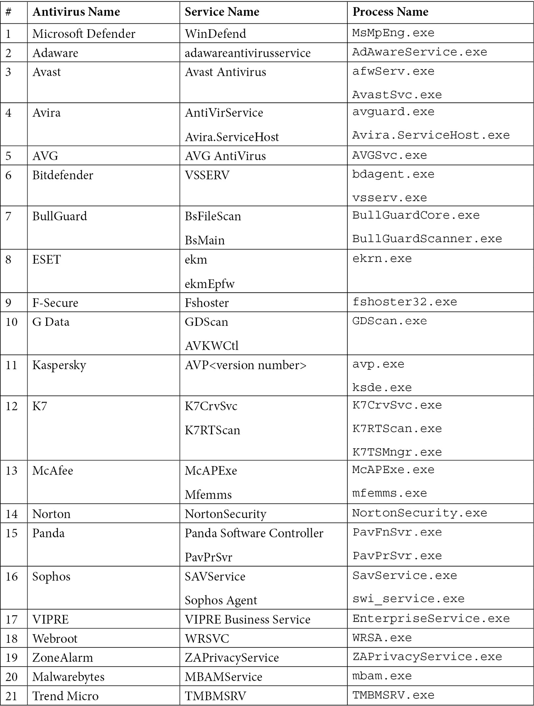

# Contents

| Project | Description |
|----------|----------|
| /payloads/benign_go_exe | Basic benign payload that pops open a message box using WIN32 API.  |
| /payloads/calc_exe | DLL written in Go that pops the calculator open |
| /payloads/direct_syscall_notepad_go | Uses direct syscalls to CreateProcess opening notepad.exe | 
| /file_parsing/pe_parser | Golang pipeline that parses PE files iteratively by parsing bytes. |
| /code_loading/load_dll_c | C program that loads a DLL |
| /code_loading_load_dll_go | Go program that loads a DLL |
| /anti_analysis/metadata_edit_go | Go program that sets icon and windows metadata during build. |
| /anti_analysis/file_float | Python script that adds 200mb nulls to the end of a file to bloat it in order to bypass AV checks that might be limited to smaller files. |
| /anti_analysis/ppid_spoofing | Spoofs the parent PID of a newly created process. |
| /payloads/datetime | A simple payload that writes a text file with the current datetime to the users downloads directory. |
| /code_loading/process_hollowing | Technique that hollows out a process and inserts the contents of a PE file inside.  |

# Golang Setup

- Every folder is a stand-alone Golang project.
- Every folder needs to be initialised with:

1. `go mod init github.com/philcantcode/goodware-lab/<parent-folder>/<sub-folder>`
2. `go mod tidy`
3. In the root `go.work` add `./<parent-folder>/<sub-folder>` 

## Compiling

- Ensure that the `CGO_ENABLE` envirionrment variable is set to `1`
- Check go environment variables by typing `go env`
- Ensure that the `CC` env variable is set in the windows environment panel, point it to MinGW
- Don't compile with Cygwin as it will require Cygwin DLLs to be present on the target
- Compile with mingw GCC instead, it uses the Win32API calls instead

Ref: https://sourceforge.net/projects/mingw-w64/files/latest/download
Ref: Pre-compiled MinGW for win: https://winlibs.com/

## Golang Things

- To import `unsafe` without actually using it and prevent FMT from removing it, do `import _ "unsafe"`

# AV Detection

| Action | Description | Defender AV Response | VirusTotal Score | Mitigation |
|----------|----------|----------|----------|----------|
| Load DLL | Loaded a DLL with calc.exe payload | None | | N/A |
| File Bloating | Adds 200mb of nulls to an executable payload | If 4GB appended, flagged as Trojan | | | Try padding with legit strings instead of nulls |
| Direct Syscalls to Open Process | Opens a process using direct syscalls | None - Would have expected it to not allow direct syscalls outside of `ntdll.dll` | 10/71 | N/A |
| PPID Spoofing | Spoofs the PPID using direct system called. | None | 9/72 | Easy to detect with ETW. |
| Process Hollowing | Processing hollowing code loading using custom syscalls | Detection on compile - might be because of the custom syscall definitions? | 8/72 | ??? |

# Tools

- Process Hacker 2 (System Informer)
- PE Bear
- Open Hardware Monitor
- Detect It Easy
- https://antiscan.me/ (Like VirusTotal but doesn't share with vendors)
- https://virusscan.jotti.org/
- https://www.virscan.org/
- PECloak

# AV Detection

- https://github.com/ethereal-vx/Antivirus-Artifacts

# Hints and Hacks

- Before process initialisation (e.g., started in the SUSPENDED state) the `RDX` register parameter of the main thread context will point to the PEB. 