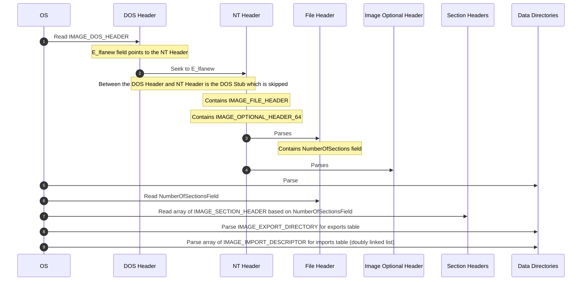

# Parsing PE Files

```mermaid

sequenceDiagram
autonumber

participant OS
participant DOS Header
participant NT Header
participant File Header
participant Image Optional Header
participant Section Headers
participant Data Directories

OS ->> DOS Header: Read IMAGE_DOS_HEADER
Note over DOS Header: E_lfanew field points to the NT Header
DOS Header ->> NT Header: Seek to E_lfanew
Note over DOS Header, NT Header: Between the DOS Header and NT Header is the DOS Stub which is skipped

Note over NT Header: Contains IMAGE_FILE_HEADER
Note over NT Header: Contains IMAGE_OPTIONAL_HEADER_64

NT Header ->> File Header: Parses
Note over File Header: Contains NumberOfSections field
NT Header ->> Image Optional Header: Parses

OS ->> Data Directories: Parse

OS ->> File Header: Read NumberOfSectionsField
OS ->> Section Headers: Read array of IMAGE_SECTION_HEADER based on NumberOfSectionsField

OS ->> Data Directories: Parse IMAGE_EXPORT_DIRECTORY for exports table

OS ->> Data Directories: Parse array of IMAGE_IMPORT_DESCRIPTOR for imports table (doubly linked list)
```